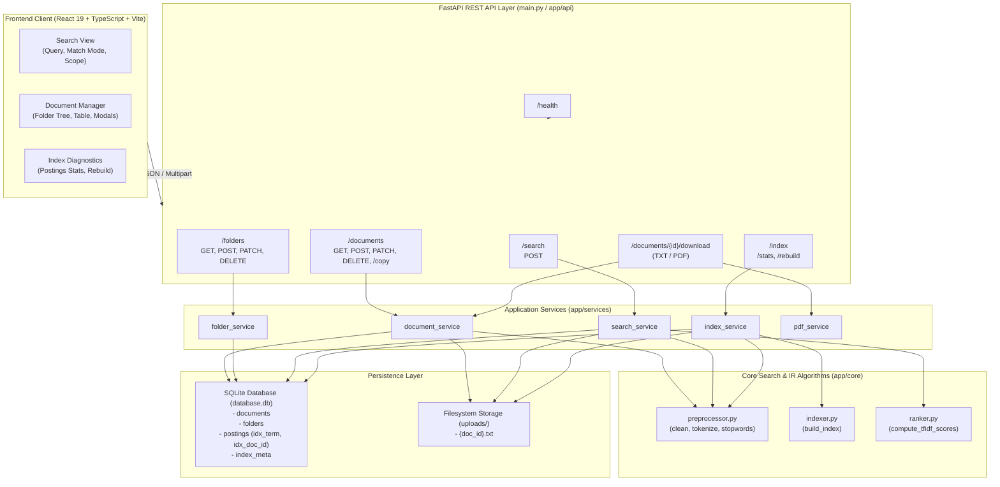
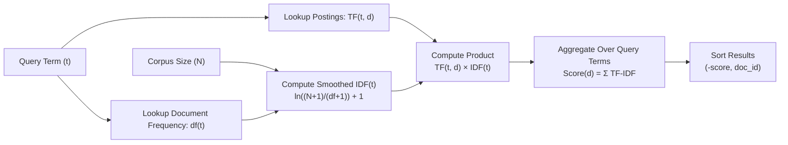
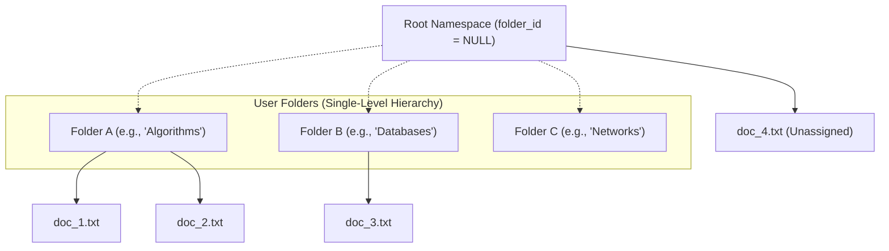
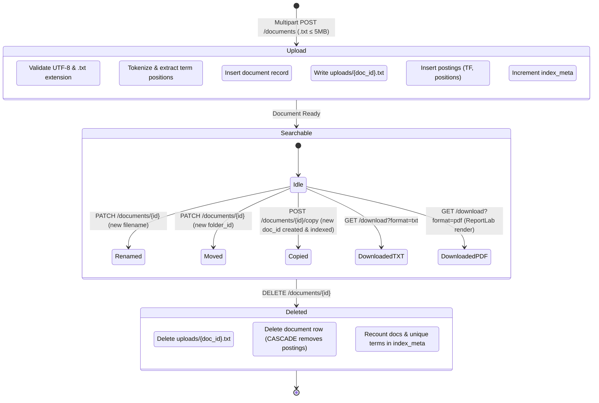
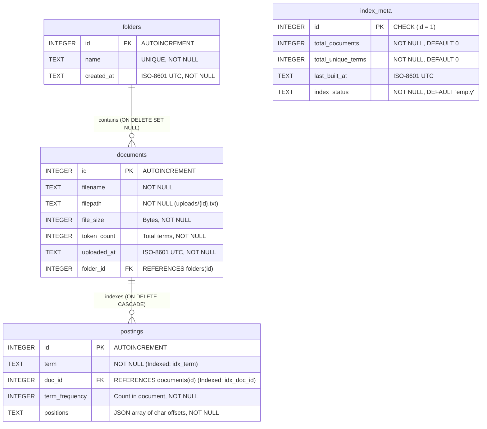

# MiniSearch

A lightweight, explainable search engine for user-managed text documents.

## Overview

MiniSearch is a self-contained, web-based search and document management system built specifically for plain-text (`.txt`) files. It provides an end-to-end information retrieval workflow: document ingestion, lexical tokenization, stopword filtering, inverted index construction, deterministic TF-IDF relevance ranking, and interactive search result inspection with comprehensive mathematical explanations.

The system implements classical Information Retrieval (IR) fundamentals from first principles:
```text
Text Preprocessing → Inverted Index → TF-IDF Ranking → Ranked Results → Explainable Search
```

MiniSearch intentionally does **not** rely on large language models (LLMs), dense vector embeddings, external search platforms (e.g., Elasticsearch, Solr, OpenSearch), caching tiers (e.g., Redis), or machine-learning models for its core indexing and retrieval pipeline. All document storage, index generation, term frequency counting, and scoring heuristics execute deterministically in Python using local SQLite and filesystem storage.

---

## Key Features

### Search
- **Plain-Text Document Search**: Fast lexical retrieval over uploaded `.txt` files.
- **Match Modes**:
  - `Any-term` (OR semantics): Returns any document containing at least one processed query term.
  - `All-term` (AND semantics): Strict conjunct match; requires all unique query terms to be present in the document.
- **TF-IDF Relevance Ranking**: Combines term frequency and corpus-wide inverse document frequency with smoothing.
- **Deterministic Tie-Breaking**: Ranks by descending score, breaking exact score ties by ascending `doc_id` to guarantee reproducible ordering across index rebuilds.
- **Search Metadata**: Reports execution duration in milliseconds, total results, query term counts, and active ranking parameters.
- **Multi-Term Highlighting**: Accurately highlights matched query terms inside result excerpts.
- **Contextual Snippets**: Automatically extracts 300-character excerpts centered on the earliest occurrence of matched terms.
- **Folder-Scoped Search**: Restricts query candidate selection to a specific folder while preserving corpus-wide IDF weights.
- **Dynamic Sorting**: Allows toggling result view between computed relevance score, filename ascending (A–Z), and filename descending (Z–A).
- **"Why this result?" Diagnostic Panel**: Detailed breakdown showing exact TF, DF, IDF, and TF-IDF contribution for every matching term.

### Document Management
- **Upload**: Ingests UTF-8 `.txt` files up to 5 MB with instant tokenization and indexing.
- **Open / Inspect**: Reads raw document text directly with metadata (file size, token count, upload timestamp).
- **Rename**: In-place filename mutation validating `.txt` extension conformance.
- **Move**: Repositions documents between user-created folders or the root namespace.
- **Copy**: Clones document text, creates a new database record, stores a duplicate physical file, and indexes the copy independently.
- **Delete**: Cascading deletion that removes the physical file from disk, deletes the database row, and purges all corresponding inverted index postings.
- **Plain-Text Download**: Exports original raw text as an attachment.
- **PDF Download**: Server-side document rendering to clean, paginated PDF format via ReportLab.

### Folder Management
- **Create**: Organizes documents into discrete, uniquely named folders.
- **Rename**: Updates folder names with uniqueness validation.
- **Delete**: Safely removes folders without data loss. When a folder is deleted, its member documents are preserved and automatically reassigned to the root directory (`folder_id = NULL`).
- **Manual Organization**: Direct, user-controlled folder organization without black-box auto-categorization.
- **Folder Filtering**: Filters document listings and search queries by selected folder.

### Index Management
- **Inverted Index**: Term-to-document mappings storing term frequencies and character offset positions.
- **Incremental Indexing**: Automatically parses and registers postings upon each file upload or document copy.
- **Full Synchronous Rebuild**: Complete administrative rebuild endpoint (`POST /index/rebuild`) that drops all existing postings, re-scans stored files, regenerates the in-memory inverted index, and repopulates SQLite tables.
- **Index Statistics**: Exposes real-time diagnostic counts of total documents, unique terms, last rebuild timestamp, and index health status (`ready`, `building`, `empty`).

### Explainable Ranking
- Every search result exposes the underlying mathematics:
  - **TF (Term Frequency)**: Frequency of the query term in that specific document.
  - **DF (Document Frequency)**: Total documents in the corpus containing the term.
  - **IDF (Inverse Document Frequency)**: Smoothed log-ratio penalizing common terms across the collection.
  - **TF-IDF Contribution**: Product of TF and IDF for each term.
  - **Total Score**: Sum of contributions for all matched query terms.

---

## Technology Stack

| Layer | Component | Version / Library | Purpose |
| :--- | :--- | :--- | :--- |
| **Frontend UI** | React | 19.2.8 | User interface components and view management |
| **Language (Web)** | TypeScript | ~6.0.2 | Strict client-side typing and interface schemas |
| **Bundler & Dev** | Vite | 8.3.1 | Build tooling and development server |
| **Styling** | Vanilla CSS | CSS3 / Design Tokens | Editorial, Notion-inspired design system |
| **Backend API** | FastAPI | 0.115+ | High-performance Python ASGI web framework |
| **ASGI Server** | Uvicorn | Standard | Asynchronous server implementation |
| **Validation** | Pydantic | v2 | Request/response data models and serialization |
| **Database** | SQLite 3 | Python `sqlite3` | Relational document metadata and postings storage |
| **PDF Generation** | ReportLab | 4.x | Clean typography, pagination, and PDF generation |
| **Testing** | Pytest & HTTPX | 9.x / TestClient | Automated integration and regression test suite |
| **Process Manager** | Concurrently | 10.x | Unified execution of backend and frontend in dev |

---

## System Architecture

The following diagram illustrates the interaction between client components, FastAPI endpoints, internal domain services, core algorithmic modules, and the persistence tier.



---

## Search Pipeline

The search system operates across two decoupled phases: **Document Ingestion & Indexing** and **Query Processing & Retrieval**.

```mermaid
flowchart TD
    subgraph Ingestion ["1. Document Ingestion & Indexing Pipeline"]
        D_Raw["Raw .txt Upload"] --> D_Clean["clean_text()<br/>Lowercasing, punctuation & standalone digit removal"]
        D_Clean --> D_Token["tokenize()<br/>Whitespace splitting"]
        D_Token --> D_Stop["remove_stop_words()<br/>56-term English stopword & length filtering"]
        D_Stop --> D_Pos["preprocess_with_positions()<br/>Compute term TF & character offsets"]
        D_Pos --> D_Postings["Persist Postings to SQLite<br/>(term, doc_id, term_frequency, positions)"]
    end

    subgraph Retrieval ["2. Query Processing & Retrieval Pipeline"]
        Q_Raw["User Query String"] --> Q_Clean["preprocess(query)<br/>Same cleaning, tokenization & stopword pipeline"]
        Q_Clean --> Q_Terms["Unique Query Terms"]
        Q_Terms --> Q_Fetch["Query SQLite Postings Table<br/>(WHERE term IN query_terms)"]
        Q_Fetch --> Q_Filter{"Folder Scoped?"}
        Q_Filter -- Yes --> Q_ApplyScope["Filter candidate doc_ids by folder"]
        Q_Filter -- No --> Q_Calc
        Q_ApplyScope --> Q_Calc["Compute TF and Smoothed IDF<br/>IDF = ln((N+1)/(df+1)) + 1"]
        Q_Calc --> Q_MatchMode{"Match Mode"}
        Q_MatchMode -- Any-term --> Q_ScoreAny["Accumulate scores for documents with ≥1 term"]
        Q_MatchMode -- All-term --> Q_ScoreAll["Accumulate scores only for documents with all query terms"]
        Q_ScoreAny --> Q_Sort["Deterministic Sort<br/>Primary: Score Descending<br/>Secondary: doc_id Ascending"]
        Q_ScoreAll --> Q_Sort
        Q_Sort --> Q_Snip["Extract Context Snippets (radius ±150 chars)<br/>from uploads/{doc_id}.txt"]
        Q_Snip --> Q_Out["Return SearchResponse Payload"]
    end
```



---

## Document Indexing Pipeline

MiniSearch processes uploaded text documents before making them searchable. Documents pass through text preprocessing, tokenization, stopword filtering, and finally become part of the inverted index.


---

## Inverted Index

An inverted index is a foundational data structure in information retrieval. Instead of scanning every document sequentially to locate a query word (forward search), the inverted index maps each unique vocabulary term to a **postings list** of documents where that term occurs.

### Example Mapping

Consider three documents:
- **doc1**: "python data structures"
- **doc2**: "search index structures"
- **doc3**: "python search engine"

The inverted index structure generated:

```text
data        → [ {doc_id: 1, tf: 1, positions: [7]} ]
engine      → [ {doc_id: 3, tf: 1, positions: [14]} ]
index       → [ {doc_id: 2, tf: 1, positions: [7]} ]
python      → [ {doc_id: 1, tf: 1, positions: [0]}, {doc_id: 3, tf: 1, positions: [0]} ]
search      → [ {doc_id: 2, tf: 1, positions: [0]}, {doc_id: 3, tf: 1, positions: [7]} ]
structures  → [ {doc_id: 1, tf: 1, positions: [12]}, {doc_id: 2, tf: 1, positions: [13]} ]
```

### Terminology
- **Term**: A normalized token (lowercased, punctuation-free, non-stopword, length $> 1$).
- **Posting**: A record linking a term to an occurrence in a specific document. In MiniSearch, each posting stores:
  - `doc_id`: Target document identifier.
  - `term_frequency` ($TF$): Total times the term appears in that document.
  - `positions`: JSON-encoded list of character offset integers in the original text, used for rapid snippet extraction.

---

## TF-IDF Ranking

Relevance scores are calculated using the Term Frequency–Inverse Document Frequency (TF-IDF) scoring heuristic.

### Mathematical Formulation

1. **Term Frequency ($TF$)**:
   The raw frequency count of term $t$ in document $d$:
   $$\text{TF}(t, d) = \text{count}(t \in d)$$

2. **Inverse Document Frequency ($IDF$)**:
   To prevent common words across the collection from dominating the ranking, terms are weighted inversely to the number of documents in which they appear. MiniSearch implements smoothed logarithmic IDF:
   $$\text{IDF}(t) = \ln\left(\frac{N + 1}{\text{df}(t) + 1}\right) + 1$$
   Where:
   - $N$ = total number of documents in the collection (`index_meta.total_documents`).
   - $\text{df}(t)$ = document frequency (count of distinct documents containing term $t$).
   - The $+1$ terms in the numerator and denominator prevent division-by-zero when $\text{df}(t) = 0$ and guarantee non-zero weights.

3. **Term Score ($TF\text{-}IDF$)**:
   $$\text{TF-IDF}(t, d) = \text{TF}(t, d) \times \text{IDF}(t)$$

4. **Document Composite Score**:
   The final relevance score for document $d$ against query $Q$ is the sum of contributions of all matching query terms:
   $$\text{Score}(d, Q) = \sum_{t \in Q \cap d} \text{TF-IDF}(t, d)$$

5. **Tie-Breaking**:
   If two documents achieve identical scores, deterministic ordering is enforced:
   $$\text{Tuple} = (-\text{Score}(d, Q), d.\text{id})$$



---

## Explainable Search

MiniSearch provides transparent scoring diagnostics for every retrieved item. Clicking **"Why this result"** reveals the exact breakdown calculated by `app/core/ranker.py`:

- **Total Score**: Final composite TF-IDF score rounded to 4 decimal places.
- **Coverage**: Number of matched query terms versus total query terms.
- **Matched Terms**: List of query tokens that occurred in the document.
- **Per-Term Technical Table**:
  - `Term`: The token evaluated.
  - `TF`: Raw occurrence count in this document.
  - `DF`: Total documents containing this term across the corpus ($df / N$).
  - `IDF`: Computed smoothed inverse document frequency.
  - `TF-IDF Contribution`: Exact scalar contribution added to the document's total score.

This design enables developers, evaluators, and students to audit why a document ranked higher or lower than its peers.

---

## Search Modes

MiniSearch supports two search modes via the `match_mode` parameter:

| Mode | Semantics | Condition | Use Case |
| :--- | :--- | :--- | :--- |
| **Any term** (`any`) | Logical `OR` | Document must contain **at least one** non-stopword query token. | Broad exploration, fuzzy queries, or discovery when exact wording is uncertain. |
| **All terms** (`all`) | Logical `AND` | Document must contain **every** non-stopword query token ($\|Q \cap d\| = \|Q\|$). | Precision-first filtering, specific phrase queries, and narrow subject retrieval. |

In both modes, matching documents are ordered by their combined TF-IDF scores.

---

## Folder and File Management

Document organization in MiniSearch uses a single-level directory structure designed for manual classification.



### Folder Characteristics
- **Manual Organization**: Folder assignment is explicitly controlled by the user (at upload, via document move, or document copy). No automated categorization is applied.
- **Single-Level Depth**: Folders cannot contain subfolders.
- **Deletion Behavior (`ON DELETE SET NULL`)**: When a folder is deleted, member documents are **not** deleted. The database sets `documents.folder_id = NULL`, preserving all files, metadata, and inverted index postings in the root namespace.

---

## Document Lifecycle

The lifecycle of an ingested document is strictly tracked from initial upload to eventual deletion:



---

## Database Design

The database schema is implemented using SQLite 3 (`database.db`) with `PRAGMA foreign_keys = ON` enabled.



---

## Backend API

All endpoints are registered through FastAPI routers prefixed by resource type.

### Health
- `GET /health`: Liveness probe returning service name and current UTC timestamp.

### Documents
- `GET /documents`: List document metadata. Supports optional query parameter `?folder_id=<int>`.
- `POST /documents`: Upload a `.txt` file (multipart form with `file` and optional `folder_id`).
- `GET /documents/{doc_id}`: Retrieve document metadata and full text content.
- `PATCH /documents/{doc_id}`: Rename document (`filename`) or move between folders (`folder_id`).
- `POST /documents/{doc_id}/copy`: Duplicate document into target folder or root (`folder_id`).
- `DELETE /documents/{doc_id}`: Permanently delete a document, its physical file, and its postings (`204 No Content`).

### Downloads
- `GET /documents/{doc_id}/download?format=txt`: Download original UTF-8 plain-text document.
- `GET /documents/{doc_id}/download?format=pdf`: Generate and download structured PDF document.

### Folders
- `GET /folders`: List all folders ordered alphabetically with document counts.
- `POST /folders`: Create a new folder (`name` required).
- `GET /folders/{folder_id}`: Retrieve folder metadata and document count.
- `PATCH /folders/{folder_id}`: Rename folder (`name` required).
- `DELETE /folders/{folder_id}`: Delete folder (`204 No Content`; documents preserved to root).

### Search
- `POST /search`: Execute ranked full-text query.
  - **Body**:
    ```json
    {
      "query": "data structures",
      "top_k": 10,
      "match_mode": "any",
      "folder_id": null
    }
    ```
  - **Response**: Returns matching documents with scores, snippets, term highlights, and TF-IDF explanation.

### Index
- `GET /index/stats`: Retrieve current inverted index metrics (`total_documents`, `total_unique_terms`, `last_built_at`, `index_status`).
- `POST /index/rebuild`: Synchronously regenerate the entire postings table from physical disk files.

---

## Project Structure

```text
MiniSearch/
├── app/
│   ├── __init__.py
│   ├── api/
│   │   ├── __init__.py
│   │   ├── documents.py          # Document CRUD & download routing
│   │   ├── folders.py            # Folder CRUD routing
│   │   ├── health.py             # Health check endpoint
│   │   ├── index.py              # Index stats & rebuild routing
│   │   └── search.py             # TF-IDF search routing
│   ├── core/
│   │   ├── __init__.py
│   │   ├── indexer.py            # In-memory inverted index construction
│   │   ├── preprocessor.py       # Lexical cleaning, tokenization & stopwords
│   │   └── ranker.py             # TF-IDF scoring & deterministic ranking
│   ├── db/
│   │   ├── __init__.py
│   │   ├── crud.py               # Database queries & transactions
│   │   ├── database.py           # SQLite connection & schema bootstrap
│   │   └── models.py             # Model definitions
│   ├── schemas/
│   │   ├── __init__.py
│   │   ├── document.py           # Pydantic schemas for documents
│   │   ├── folder.py             # Pydantic schemas for folders
│   │   ├── index.py              # Pydantic schemas for index metadata
│   │   └── search.py             # Pydantic schemas for search requests/responses
│   └── services/
│       ├── __init__.py
│       ├── document_service.py   # Document storage & pipeline orchestration
│       ├── folder_service.py     # Folder management business logic
│       ├── index_service.py      # Index statistics & full rebuild workflow
│       ├── pdf_service.py        # ReportLab PDF compilation service
│       └── search_service.py     # End-to-end search query orchestration
├── frontend/
│   ├── index.html                # Single-page application entry HTML
│   ├── package.json              # Frontend dependencies and npm scripts
│   ├── tsconfig.json             # TypeScript root configuration
│   ├── tsconfig.app.json         # TypeScript client build configuration
│   ├── tsconfig.node.json        # TypeScript Node tooling configuration
│   ├── vite.config.ts            # Vite configuration
│   └── src/
│       ├── App.tsx               # Root component & view navigation
│       ├── index.css             # Notion-like typography & design system
│       ├── main.tsx              # React DOM mounting entry point
│       ├── components/
│       │   ├── Sidebar.tsx       # Collapsible navigation & folder tree
│       │   ├── TopHeader.tsx     # Top navbar with live index status
│       │   └── UploadModal.tsx   # Drag-and-drop file upload modal
│       ├── lib/
│       │   ├── api.ts            # Typed client API communication service
│       │   └── utils.ts          # Formatting utilities (file size, dates)
│       └── pages/
│           ├── DocumentViewPage.tsx # Document inspection view
│           ├── DocumentsPage.tsx    # File manager table & action controls
│           ├── IndexPage.tsx        # Diagnostics & engine settings
│           └── SearchPage.tsx       # Search bar, results & explainability panel
├── tests/
│   ├── __init__.py
│   ├── conftest.py               # Pytest fixtures & isolated test DB setup
│   ├── test_documents.py         # Document upload, rename, move, delete tests
│   ├── test_download.py          # TXT and PDF export tests
│   ├── test_folders.py           # Folder management & cascade tests
│   ├── test_health.py            # Liveness endpoint test
│   ├── test_index.py             # Inverted index & rebuild tests
│   └── test_search.py            # TF-IDF, match modes, and scoping tests
├── uploads/                      # Local document storage directory (.txt files)
├── .env                          # Backend environment configuration
├── .gitignore                    # Git ignore rules
├── database.db                   # SQLite runtime database file
├── main.py                       # FastAPI application entry point & CORS
├── package.json                  # Root runner script (concurrent execution)
├── requirements.txt              # Production Python dependencies
├── requirements-dev.txt          # Test and development Python dependencies
└── README.md                     # Project technical documentation
```

---

## Running Locally

### Prerequisites
- Python 3.10+ (tested on Python 3.12)
- Node.js 18+ and npm
- Git

### 1. Clone Repository
```bash
git clone https://github.com/Aaryan-2903/MiniSearch.git
cd MiniSearch
```

### 2. Backend Setup
Create and activate a virtual environment:
```bash
# Windows (PowerShell)
python -m venv venv
.\venv\Scripts\Activate.ps1

# Linux / macOS
python3 -m venv venv
source venv/bin/activate
```

Install backend dependencies:
```bash
pip install -r requirements.txt
pip install -r requirements-dev.txt
```

Verify or create root `.env`:
```ini
DATABASE_URL=./database.db
UPLOAD_DIR=./uploads
```

### 3. Frontend Setup
Install frontend dependencies:
```bash
npm --prefix frontend install
```

### 4. Running the Development Server
You can run both backend and frontend concurrently from the project root:
```bash
npm run dev
```

Alternatively, run each service in separate terminals:
```bash
# Terminal 1: Backend API (runs at http://127.0.0.1:8000)
uvicorn main:app --reload

# Terminal 2: Frontend Client (runs at http://localhost:5173)
npm --prefix frontend run dev
```

### 5. Production Build
To validate the frontend build:
```bash
npm --prefix frontend run build
```

---

## Testing

MiniSearch includes a comprehensive automated test suite built on Pytest and FastAPI's `TestClient` (using an isolated SQLite test database and temporary upload directory).

### Run Test Suite
```bash
pytest
```

### Verified Test Results
```text
============================= test session starts =============================
platform win32 -- Python 3.12.10, pytest-9.1.1, pluggy-1.6.0
rootdir: C:\Users\Aryan\Downloads\re4\MiniSearch
collected 81 items

tests\test_documents.py ...............                                  [ 18%]
tests\test_download.py ..............                                    [ 35%]
tests\test_folders.py ..............                                     [ 53%]
tests\test_health.py .                                                   [ 54%]
tests\test_index.py .................                                    [ 75%]
tests\test_search.py ....................                                [100%]

======================== 81 passed in 4.30s =========================
```

The frontend build is also verified with TypeScript compilation:
```bash
npm --prefix frontend run build
# Output: ✓ 25 modules transformed. dist/ created successfully.
```

---

## Design Principles

MiniSearch's user interface is purposefully designed with the following principles:

1. **Restrained Productivity Tool**: Inspired by editorial tools like Notion, utilizing high-contrast typography, warm neutrals (`#F7F6F2`, `#FFFFFF`), subtle borders (`#E6E4DF`), and controlled blue accents (`#2563EB`).
2. **Text-First & Document-Centric**: Primary emphasis is on readability, structured tables, and content snippets rather than flashy decorative graphics.
3. **No Artificial Intelligence**: Search ranking is explicitly deterministic. Users can verify why results appear in their given order through concrete mathematical explanations.
4. **Minimalist Visual Hierarchy**: No unnecessary gradients, glassmorphism, floating cards, or animated backgrounds.
5. **Clear Operational States**: Distinct visual feedback for loading, index rebuilds, empty queries, empty folders, and file downloads.

---

## Limitations

- **File Type Constraint**: Ingestion and indexing are strictly limited to plain-text UTF-8 files (`.txt`). Binary documents (PDF, DOCX, EPUB) cannot be ingested into the index directly.
- **Single-Level Folders**: Folders do not support nested subfolder trees.
- **Lexical Matching Only**: Search queries rely strictly on lexical matching (token overlap). Synonyms, semantic concepts, and grammatical variations that do not share exact token stems are not retrieved.
- **No Stemming / Lemmatization**: Tokens are normalized by lowercasing and punctuation removal, but Porter stemming or WordNet lemmatization is not applied (e.g., `"running"` and `"run"` are treated as distinct terms).
- **Single-Node Local Storage**: SQLite and the local `uploads/` directory are designed for single-node workstation or small-team deployments.
- **No Authentication / Multi-Tenancy**: The application operates in a single-tenant workspace without user authentication or role-based access control.

---

## Future Scope

The following architectural expansions represent potential future directions:

- **Additional File Format Parsers**: Integrating text-extraction libraries to parse and index `.pdf`, `.docx`, `.md`, and `.csv` files.
- **Morphological Analysis**: Implementing Porter Stemming or Snowball lemmatization within `app/core/preprocessor.py`.
- **Phrase and Proximity Search**: Utilizing the already persisted character offset `positions` array to calculate term distances and support exact-phrase queries (e.g., `"binary search"`).
- **Configurable Ranking Heuristics**: Allowing runtime switching between raw TF-IDF and Okapi BM25 ranking.
- **Authentication & Multi-Tenant Partitioning**: Introducing JWT-based authentication and scoping folders/documents by user tenant ID.
- **Distributed Indexing**: Supporting disk-backed B-Trees or partitioned postings tables for datasets scaling beyond millions of postings.
- **Optional Hybrid Retrieval**: Providing an optional, opt-in dense vector retrieval layer to complement the deterministic lexical index.

---

## Project Status

The core implementation of MiniSearch is complete, fully tested, and stable:
- Document CRUD, folder management, and TXT/PDF exports are operational.
- The inverted index, incremental indexing, and synchronous rebuild workflows are functional.
- TF-IDF search with `any` and `all` match modes, folder scoping, and explainability panels is complete.
- **81 automated test cases** pass with zero failures.
- Production frontend bundle compiles cleanly without type or build errors.

---

## License

MiniSearch is licensed under the [MIT License](LICENSE).
